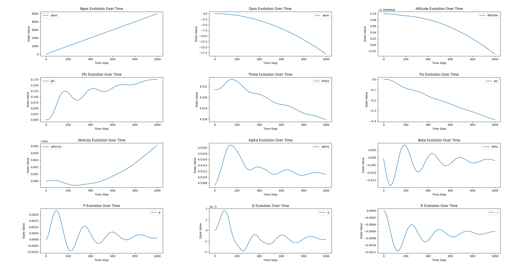

# pyf16

[English](README.md) | [中文](README_zh.md)

`pyf16` is a Python library for simulating F-16 aircraft dynamics.

Below is a plot showing the variation of different states of the simulated F-16 at the trim point over time:



## Installation

This project provides precompiled programs for the aerodynamic model, supporting x86 platforms on Windows and Linux systems. If your operating system meets the requirements, you can skip the compilation steps and use the precompiled programs directly. If you need compiled programs for other platforms or wish to compile them yourself, please follow the steps below.

### Installing the Aerodynamic Model

#### Obtaining Precompiled Programs

Precompiled programs for the aerodynamic model on x86 platforms for Windows and Linux are provided in the attachments. You can also download the relevant versions from the project's [GitHub repository](https://github.com/WindLX/pyf16/releases).

The directory structure required to run the program is already configured, with the aerodynamic model, aerodynamic data, and related information files placed in the `models/f16_model` directory. If your system meets the requirements, you can skip the compilation steps.

#### Compiling the Aerodynamic Model Yourself

If you need to compile the aerodynamic model, ensure that your system has CMake and any C language compiler installed, and that the environment variables are correctly configured.

1. Open a shell (PowerShell is recommended on Windows) and navigate to the `f16_model` directory.

2. Execute the following commands:
    ```bash
    cmake -S . -B build
    cmake --build build [--config Release] --target install
    ```

3. After compilation, an `install` folder will be generated in the `f16_model` directory. Next:
    - Create a `models` folder in the top-level directory of the program.
    - Copy the `f16_model` directory from the `install` folder to the `models` directory.

### Installing pyf16

#### Installing with pip

You can directly use the published version on PyPI by running the following command:
```bash
pip install pyf16
```

#### Compiling and Installing from Source

If you do not have a suitable Wheel file version, you can compile and install from the source. First, ensure that your system has the Rust compiler installed.

##### Using uv

If you use `uv` for Python project management, you can directly run the following command:

```bash
uv run examples/example1.py
```

`uv` will automatically create a virtual environment, install the required modules, and then execute the example program.

##### Without uv

If you do not use `uv`, follow these steps:

1. Create a virtual environment:
    ```bash
    python -m venv .venv
    ```

2. Activate the virtual environment:
    - Linux/macOS:
      ```bash
      source ./.venv/bin/activate
      ```
    - Windows:
      ```powershell
      .\.venv\Scripts\Activate.ps1
      ```

3. Install dependencies:
    ```bash
    pip install maturin
    ```

4. Compile and install the module:
    ```bash
    maturin develop
    ```

5. Install Python library dependencies:
    ```bash
    pip install matplotlib numpy
    ```

6. Run the example program:
    ```bash
    python examples/example3.py
    ```

### Running Example Programs

After installation, you can run the following command to verify if the installation was successful:

```bash
python examples/example1.py
```

Or, if you use `uv` to manage the virtual environment, you can run:

```bash
uv run examples/example1.py
```

## Usage Examples

### F-16 Simulation

Here is a simple usage example demonstrating how to load the aerodynamic model, install the model, load control limits, perform trim calculation, and create an aircraft object:

```python
import pyf16

aero_model = pyf16.AerodynamicModel("/path/to/f16_model")
aero_model.install("/path/to/f16_model/data")
control_limits = aero_model.load_ctrl_limits()

trim_target = pyf16.TrimTarget(15000, 500, None, None)
trim_init = None
trim_result = pyf16.trim(aero_model, trim_target, control_limits, trim_init).to_core_init()

f16 = pyf16.PlaneBlock(
     pyf16.SolverType.RK4,
     0.01,
     aero_model,
     trim_result.to_core_init(),
     [0, 0, 0],
     control_limits,
)
core_output = f16.update(
     pyf16.Control(thrust=100, elevator=0, aileron=0, rudder=0), 0.1
)
print(core_output.state.to_list())

f16.delete_model()
aero_model.uninstall()
```

### SimpleSolver

`pyf16` also provides a simple solver interface for solving ordinary differential equations in Python:

```python
from pyf16 import SolverType, SimpleSolver

# dx/dt = -k * x
def simple_dynamics(time: float, state: List[float], input_: List[float]) -> List[float]:
     k = input_[0]
     dx_dt = [-k * state[0]]
     return dx_dt

initial_state = [10.0]
input_value = [0.1]
time_step = 0.1
simulation_time = 5.0

solver_type = SolverType.RK4
solver = SimpleSolver(solver_type, delta_t=time_step)

state = initial_state
time = 0.0
while time < simulation_time:
     state = solver.solve(simple_dynamics, time, state, input_value)
     time += time_step
     print(f"Time: {time:.1f}, State: {state[0]:.4f}")
```

## API

See the [API](docs/API.md) documentation.

## TODO

- [ ] More detailed documentation
- [x] Variable ODE solver

## LICENSE

[License](LICENSE)

## Acknowledgements

Some implementations of this project reference code provided by the following website:
- [DARPA SEC Software](https://dept.aem.umn.edu/~balas/darpa_sec/SEC.Software.html)

Thanks to the contributors of that project.
